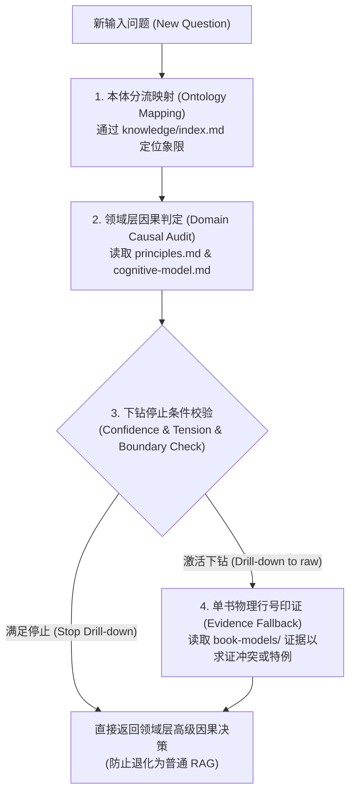

## 1. Runtime Reasoning Flow (运行时推理流水线)

当用户或上层 Agent 针对新领域问题进行提问时，推理必须刚性经历以下四步：



---

## 2. Down-drilling Stop Rules (下钻停止与分流规则)

为了防止系统退化为无目的的、基于关键词的普通 RAG 碎片搜索，推理引擎必须遵守以下**下钻停止规则**：

### 规则 A — 领域层直接拦截 (Domain Layer Intercept)
如果 `knowledge/` 层的原则（Principles）或因果模型（Causal Models）满足以下全部条件，**禁止下钻**到单书 `generated/book-models/` 或 `corpus/raw/`：
1. **信度门槛 (Confidence Threshold)**：该原则的 Confidence 分数 $\ge 2.0$。
2. **张力隔离 (Tension-free)**：该原则的路由节点没有涉及重大的系统性冲突张力（Tensions）。
3. **边界匹配 (Boundary Alignment)**：用户问题的输入场景，完全落在此原则已明确定义的“适用范围（Scope）”之内，没有触发“失效条件”。
此时直接输出该原则的硬核 Decision Heuristics 进行指导。

### 规则 B — 强制下钻求证 (Force Drill-down)
只有当发生以下情况时，才允许并强制下钻读取单书数据：
1. **张力触发 (Tension Explored)**：问题处于对立学派（如利他 vs. 利己、心性内省 vs. 规范从众）的交界区，必须下钻到对应的两本或多本单书模型，提取其对立论据进行辩证权衡。
2. **失效边界触碰 (Exception Probed)**：场景处于原则的“失效条件”边缘（如萧何自污原则在现代法治企业中的异化），必须下钻求证特定历史案例的具体约束。
3. **极高精度诉求 (High-precision Request)**：用户明确要求审计最底层的 Provenance 物理原文行号作为法理证据。

---

## 3. Decision Generation Contract (决策输出协议)

最终的领域输出答复必须使用以下顶层中文结构：

```markdown
# 领域认知判定与决策报告

## 1. 问题本质判定 (Ontology Classification)
- 本问题属于 `[象限名称]` 的 `[核心概念/原则]` 本体范畴。
- 当前信心值 (Confidence)：`[分值]/5.0`。

## 2. 核心因果机制 (Causal Logic)
- 详细说明当前问题背后的客观因果滚动链条（如CM001自毁环等）。

## 3. 流派张力与边界评估 (Tensions & Boundary Audit)
- 评估该决策是否触碰了任何流派张力或边界例外条件。

## 4. 可执行规则与具体行动 (Decision Heuristics)
- Use when: ...
- Diagnostic question: ...
- Action tendency: ... (写明具体的、可物理落实的行动方案)

## 5. 证据链回溯 (Evidence Provenance)
- 标注源自哪本书的哪一行号，如 `[017:L1548]`。
```
