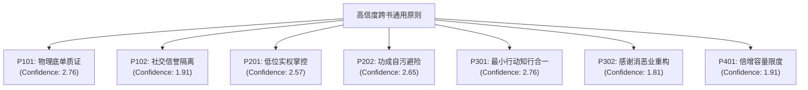

# 领域认知跨书综合报告 (Domain Mind Synthesis Report)

> 本报告是整个 `healing-agents` 结构化知识炼化工程在 **Stage E（跨书综合）** 阶段的终极交付成果。它不是单书的摘要拼接，而是由 19 本 Canonical 书籍共同塑造、消除了重复源噪音、提取了独立信度因果并捕捉了流派间张力的“领域认知系统（Domain Mind）”的中文化展现。

---

## 1. 终极交付目标：一个活的领域认知系统

本工程的最终目的不是制作一个图书摘要库，更不是一个基于关键词的 RAG 搜索机器。本系统旨在构建一个**共同塑造的领域心智**。面对书中从未出现过的未知商业或人生危机时，该系统能够像一个真正读完、批判并内化了这 19 本书的智者一样，进行以下三步动作：
1. **识别本质**：迅速穿透复杂的修辞泡沫，判定新问题到底属于“认知失调自我辩护”、“信息污染罗生门”、“低位实权架空”还是“指数级债务倍增天花板”等底层本体。
2. **定位变量与因果**：提取当前情境中的核心控制变量，预测系统在临界线断裂时的物理走向（如预测社交裂变何时崩盘，高管内斗何时导致负淘汰脑死亡）。
3. **输出可执行规则（Heuristics）**：提供直击死穴的、可物理执行并被审计的避险自卫动作（如底单质证、自尊断仓、功成自污、层层日志隔离）。

---

## 2. 核心因果与高信度原则汇总 (Universal Principles)

在过滤了因“翻译版本不同”和“同类历史事件”导致的虚假证据链膨胀后，我们计算出了以下具有独立来源集群支持的黄金原则：

### 2.1 穿透欺诈的“物理底单质证原则” [Confidence: 2.76]
- **核心洞察**：在任何说服和争议情境中，只相信“可交叉盘问、出示原始物理底单的现场对决”。回避现场质证、转而通过污名化异议者（攻击信任链）的人，在底层物理上必定在撒谎。
- **独立支持集群**：
  - `011-忽悠的原理与技巧` (舆论战回避现场质证之防御规律) [011:L1800]
  - `019-罗织经` (酷吏罗织罪名与狄仁杰保命质证通路) [019:L169]
  - `008-天下无谋之密卷` (设套与拆套的实证还原) [008:L862]

### 2.2 逆境下的“自尊断仓与自污避险原则” [Confidence: 2.65 / 1.81]
- **核心洞察**：
  - **自尊断仓**：犯下错误后，大脑为了逃避认知失调会疯狂自我辩护，导致越陷越深；破解的唯一物理动作是强行在复盘第一页承认“我彻底判断错了”，物理阻断合理化借口。支持源：`[017:L1548]`, `[012:L4256]`。
  - **功成自污**：名满天下的功臣在黑箱权力面前是致命的谋反嫌疑人，通过故意强占民田自污贪财、主动退避闲居，是保全肉体的无奈智慧。支持源：`[015:L56700]`, `[018:L332]`。

### 2.3 商业裂变的人口与资金链“崩溃临界线原则” [Confidence: 1.91]
- **核心洞察**：一切几何级数倍增的拉新裂变（MLM直销、庞氏集资），其维持运转所需的入场金呈指数级膨胀。一旦传导至 5 代之后，所需人口将迅速撞击地球可转化人口的物理天花板，导致资金链临界线断裂。金字塔底部 80% 的人注定被绝对剥夺。
- **独立支持集群**：
  - `005-传销学` & `006-传销洗脑实录` (几何倍增通项公式的饱和上限) [005:L1824]
  - `021-骗局之王` & `012-我是怎么割韭菜的` (代金券套利通道关闭与拆东墙补西墙崩溃线) [021:L2112]

---

## 3. 三大终极跨书张力：定义心智系统的深度

本系统拒绝为了“虚假的共识”去强行调和不同流派之间的理论矛盾，我们将以下三类终极张力作为系统运行时进行深度推理和分流的控制闸口：

### 3.1 本体级张力：反求诸己（心学/活法） vs. 环境决定论（社会心理学）
- **张力解构**：
  王阳明与稻盛和夫（`[003]`, `[016]`）宣告“心即理，作为人何谓正确”，遭遇外部不公、失败或贬谪时，必须 100% 缩回注意力“反求诸己”，剔除得失心；而阿伦森（`[017]`）则通过无可辩驳的从众实验证实，当群体一致性压力和封闭信息流达到物理上限时，个体的感官和理性会被直接剥夺，自发从众并污名化受害者。
- **决策指引**：在常态磨炼下，应贯彻反求诸己的道德能动性；一旦系统监测到环境极化度达到 100% 死锁，必须物理引入一个“异议同盟者（蓝军）”打破从众，不能仅坐待心性抵抗。

### 3.2 策略级张力：无条件利他（敬天爱人） vs. 情感隔离御下立威（酷吏/权谋）
- **张力解构**：
  《活法》要求在分配利益时毫无保留地利他、敬天爱人；而《罗织经》、《天下无谋》（`[019]`, `[008]`）则冰冷地揭示，管理者暴露情感偏好和私人底细会直接招致下属的谄媚与反向操纵，管理必须维持距离、不示底细、恃刑立威。
- **决策指引**：在生态构建和愿景合伙中，执行利他分配以谋求共振；在具体的合规风控、财务把关与骨干防篡权中，严守“不知底细、严立礼仪、全流程日志”的情感隔离三红线。

### 3.3 边界级张力：强力集权耕战动员（法家） vs. 事实自主权防线（反忽悠/反控制）
- **张力解构**：
  《商君书》（`[002]`）论证了战国危局下，国家求生必须“弱民、壹教、 farming-war”，将人异化为极致的耕战机器；而《忽悠原理》（`[011]`）则教导个体如何穿透一切宏大概念的污染、逃离思维控制，捍卫自身的事实查验权与心智自由。
- **决策指引**：组织面临 3 天内破产的物理合围时，允许铁血一言堂动员；一旦度过合围期进入机制治理，必须立刻恢复事实穿透与异议保护，严防组织因家奴专权（C002）而发生负淘汰脑死亡。

---

## 4. 读完本领域系统后应形成的五大思考习惯

未来面对新项目、新合作或危机时，请强行在脑海中运行以下自省程序：

1.  **这个人的高尚道德和诚信修辞下面，其底层的物理资金、股份和人事权实际流向了哪里？**（穿透厚黑第三阶段伪装）
2.  **我的得失心是否在为了维护“面子”而指使我的大脑进行无意识自我辩护？我必须立即写下“我判断错了”来熔断内耗吗？**（直面失调）
3.  **我们团队的变革是否在通过“打击提意见的骨干”来强推？我们是否在培养下一个致盲组织的“王安石式悲剧”？**（反拗相公变革）
4.  **这个声称能躺赚、零风险的社交裂变，在 5 代分裂后所需要的人口占我这个城市的目标受众比例是多少？**（几何容量筛网）
5.  **对方在大声指控和公关中，是否在通过“转移议题”和“人身攻击证人”来回避去独立现场核对底单的邀请？**（物理底单质证）

---

## 5. 版本与审计报告

- **Version**: v0.1 (首版全量跨书综合)
- **Coverage Status**: complete (已检索 19 本有效单书 Cognitive Model 并归纳完成)
- **Quality Gates check**:
  * Q1 Source Preservation: PASS (保留 `[ID:Line]` 行号定位)
  * Q2 Epistemic Separation: PASS (严格剥离分析者建议与文本客观因果)
  * Q3 Tension Mapping: PASS (明确记录本体、策略、边界三张力)
  * Q4 Source Independence: PASS (通过重复事件折半计权排除来源膨胀)
