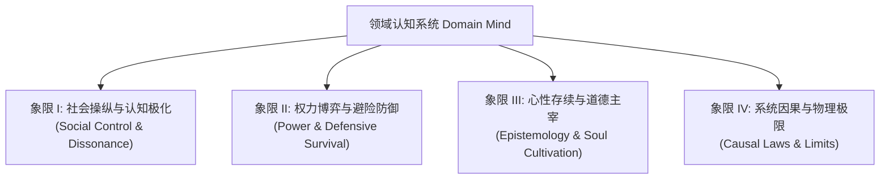

# Domain Mind Knowledge Router & Ontology Index

> 本文件是领域认知系统的知识分流与本体索引地图。它定义了当前书库共同塑造出的领域概念空间，并将具体的认知问题引向相应的原则与因果模型。

## 1. 领域本体架构 Core Ontology Domains

整个领域的知识本体划分为四个相互咬合的宏大概念象限：

---

## 2. 概念索引与路由规则 Ontology Routing Table

未来遇到具体的查询和决策问题时，Agent 或读者应根据以下分类进行精准路由：

### 象限 I：社会操纵与认知极化 (Social Control & Dissonance)
*探讨个体与群体如何受到外界信息的说服、暗示、操纵，以及如何在行为绑定后通过自我辩护走向观念极化。*

| 本体概念 (Concept) | 路由指向 (Routing Destination) | 支持书源与 Provenance (Sources) |
|---|---|---|
| **从众与群体压力 (Conformity)** | `principles.md#P101` | [017:L68], [006:L3337] |
| **认知失调与自我辩护 (Dissonance)** | `cognitive-model.md#C001` | [017:L1548], [012:L4256] |
| **假证据链与阴谋论 (Fake Evidence Chain)**| `cognitive-model.md#C002` | [011:L633], [019:L200] |
| **信息污染与罗生门战术 (Information Pollution)**| `principles.md#P102` | [011:L2669], [006:L280] |
| **去人性化污名化 (Dehumanization)** | `cognitive-model.md#C003` | [017:L2170], [019:L1356] |

---

### 象限 II：权力博弈与避险防御 (Power Dynamics & Defensive Survival)
*探讨在高度人治或专制的集权环境中，行动者如何争夺实权、防范反噬，以及在面临生命或职业绞杀时如何全身远害。*

| 本体概念 (Concept) | 路由指向 (Routing Destination) | 支持书源与 Provenance (Sources) |
|---|---|---|
| **雄猜之主与特务控制 (Autocracy)** | `cognitive-model.md#C004` | [001:L104], [019:L721] |
| **低位架空与实权垄断 (Low-profile Takeover)**| `principles.md#P201` | [001:L630], [008:L4383] |
| **自污求生与避忌退隐 (Self-defiling Survival)**| `principles.md#P202` | [015:L56700], [018:L332] |
| **御下隔离与隐藏底细 (Emotional Detachment)**| `cognitive-model.md#C005` | [019:L307], [008:L862] |
| **办事二术（锯箭与补锅） (Bureaucratic Maneuvers)**| `principles.md#P203` | [013:L124] |

---

### 象限 III：心性存续与道德主宰 (Epistemology & Soul Cultivation)
*探讨在纷繁复杂的红尘磨炼中，个体如何摆脱利益得失的奴役，实现知行无缝闭环与灵魂净化。*

| 本体概念 (Concept) | 路由指向 (Routing Destination) | 支持书源与 Provenance (Sources) |
|---|---|---|
| **知行合一 (Unity of Knowledge & Action)** | `principles.md#P301` | [003:L276], [016:L76] |
| **心即理与作为人何谓正确 (Moral Realism)**| `cognitive-model.md#C006` | [003:L196], [016:L68] |
| **感谢消恶业的逆境消化 (Gratitude in Adversity)**| `principles.md#P302` | [016:L1548], [010:L2416] |
| **达观隔离与精神超越 (Spiritual Transcendence)**| `principles.md#P303` | [001:L4443], [018:L120] |
| **必有事焉的日常精进 (Daily Self-reflection)**| `cognitive-model.md#C007` | [003:L3106], [016:L76] |

---

### 象限 IV：系统因果与物理极限 (Causal Laws & Limits)
*探讨不以个体意志为转移的宏观物理限制、债务指数膨胀规律以及心性格局的反馈场。*

| 本体概念 (Concept) | 路由指向 (Routing Destination) | 支持书源与 Provenance (Sources) |
|---|---|---|
| **几何倍增学的人口天花板 (Compounding Limits)**| `principles.md#P401` | [005:L1824], [005:L9668] |
| **庞氏崩盘临界线 (Ponzi Collapse Line)** | `principles.md#P402` | [021:L2112], [012:L161320] |
| **利他格局的反馈共振 (利他反馈) (Altruistic Resonance)**| `principles.md#P403` | [014:L1300], [016:L2800] |

---

## 3. 冲突分流路由 (Tension Router)

当问题涉及多维博弈和价值对立时，系统应分流至以下冲突节点进行多义性分析：

1. **内省与外求冲突 (Introspection vs. External Attending)**: 路由至 `cognitive-model.md#T001`
   * 传习录心即理 vs. 社会性动物环境归因
2. **纯善利他与冷酷隔离的商业/政治生存冲突 (Altruism vs. Isolation)**: 路由至 `cognitive-model.md#T002`
   * 活法敬天爱人 vs. 罗织经御下不示底细、恃刑立威
3. **法铁血集权动员与防范忽悠控制冲突 (Autocratic Mobilization vs. Defensive Autonomy)**: 路由至 `cognitive-model.md#T003`
   * 商君书弱民 FARMING-WAR vs. 忽悠原理防范话语权控制
